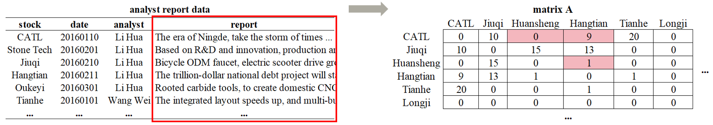
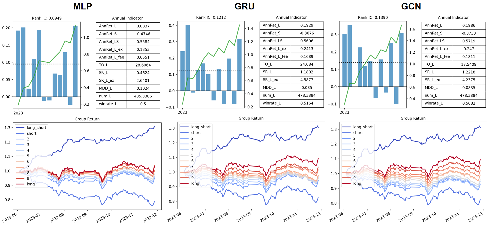
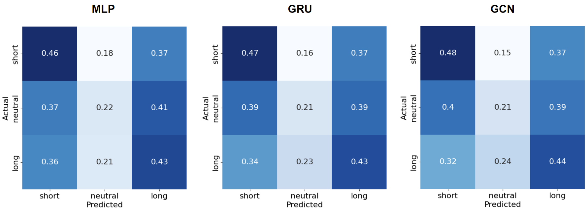

# Title: Stock Prediction Based on Report Similarity

**Group 6:** [Wang Xin](https://github.com/ShawnWangXin) & [Gong Jiaxin](https://github.com/mecc10?tab=repositories)

**Instructor Professor:** [Jaehyuk Choi](https://github.com/jaehyukchoi)

**RA mentor:** Su Nan

### Data

* stock price and volume data is from WIND database
* analyst report data is from Suntime database
* alpha 101 from ricequant database
* access through **PHBS finlab**
* standardize cross-sectionally

## 1. Motivation

### 1.1 Shared Analyst Coverage

> **Shared Analyst Coverage Factor** (Ali & Hirshleifer, 2020):
> visualize stocks' fundamental connection by using analyst report data.

**(1) Matrix Construction**

<!-- for each quarter: initialize a zero matrix $A_{m×m}$, select reports published in the past 6 months
	for each analyst: find all stocks covered by it
		for each pair of covered stock $i$ and stock $j$:
			$A_{ij} += 1$ -->

<p align='center'></p>

<p align='center'></p>


**(2) Factor Calculation**

$$
s a c_i=\frac{\sum_{j=1}^N \log \left(A_{i j}+1\right) mom_j}{\sum_{j=1}^N \log \left(A_{i j}+1\right)} {\text{  }} (sac_i
{\text{ is the factor of }}stock_i{\text{, }} mom_j{\text{ is the past momentum of }}stock_j)
$$

* If some $stocks_j$ increased in the past, the $stock_i$ connected to them may increase in the future

* However, we used to replicate this anomaly factor, **but found it was not as good as said in the paper**.
* So, how can we do some incremental research?

### 1.2 Textual Similarity

Textual similarity provides a new perspective.

<p align='center'></p>

> **Technological Link Factor** (Lee et al., 2019): used patents' IPC number to construct firm-level vector, used similarity to construct matrix, calculated factor.

> **Innovation Similarity Factor** (Bekkerman et al., 2022): used patents' text to construct firm-level vector, used  similarity to construct matrix, calculated factor.

**Our idea:**

* Textual Similarity reminds us that there is a report text column in original data, which was ignored in past paper.
* However, shared analyst coverage only used the number of analysts, which may not capture the indirect connection between firms.
* Instead, we can try constructing matrix by using report text similarity.

<p align='center'></p>

## 2. Methodology

### 2.1 Matrix Construction

<!-- for each quarter: initialize a zero matrix $S_{m×m}$, select reports published in the past 6 months
 	vectorize report text to stock vector
    for each pair of stock i and stock j:
		$S_{ij}+= cos(vec_i, vec_j)$ -->

<p align='center'></p>

### 2.2 Factor Calculation

$$
sac.txt_i=\frac{\sum_{j=1}^N S_{i j} {\text{  }}mom_j}{\sum_{j=1}^N S_{i j}} {\text{  }} (sac.txt_i
{\text{ is the factor of }}stock_i{\text{, }} mom_j{\text{ is the past momentum of }}stock_j)
$$

### 2.3 Stock Prediction Model

(1) Cross Section: MLP, LR, RF, GBDT
```
[batch_size, feature_num] -> [batch_size, 1]
```
(2) Time series: RNN
```
[batch_size, sequence_len, feature_num] -> [batch_size, 1]
```
(3) Graph:  GCN
```
matrix S + [batch_size, sequence_len, feature_num] -> [batch_size, 1]
```

<p align='center'></p>


## 3. Experiment

#### 3.1 Fintune Parameter

| Model | Parameter | Value          |
| ----- | --------- | -------------- |
| BERT  | length    | 500            |
|       | pooling   | first-last-avg |
| RF   | n_estimators| 100         |
|       | max_depth| 15    |
| GBDT   | n_estimators| 100         |
|       | max_depth| 15    |
| MLP   | alpha     | 0.001          |
|       | hidden size| (64, 32)      |
| GRU   | num_layers | 2             |
|       | hidden size| 64            |
| GCN   | num_layers | 4             |


#### 3.2 Single Factor Test
* Assumption: The larger the factor value is, the greater the stock return will be in the future
* Group Invetment Return: rank the stocks by the factor value in descending order into 10 groups, then long the 10th group, short the 1st group.


#### 3.3 Model Comparison

* Invetment Performance


* Confusion Matrix
* We predict on regression basis. Since classifying the top and bottom group of stock is more significant in investment. We will rank and classify the regression result and analyze **confusion matrix**.



## 4. Conclusion

### (1) Current Work

* [X] We use textual similarity to improve shared analyst coverage factor.
* [X] We use claculated matrix to enhance stock prediction model.

### (2) TODO
* [ ] Add more models.

* [ ] As training model took a long time, we only splitted train and test set once. We will use **time series cross validation** later on.

### (3) Academic Discussion

* [ ] Shared analyst coverage factor seemed invalid after 2023. Thus, we can only explore it in research usage. Besides, we can implement analysis to reveal hidden information channel and **momentum spillover effect**.

## 5. Reference

```
Ali, U., & Hirshleifer, D. (2020). Shared analyst coverage: Unifying momentum spillover effects. Journal of Financial Economics, 136(3), 649-675.

Lee, C. M., Sun, S. T., Wang, R., & Zhang, R. (2019). Technological links and predictable returns. Journal of Financial Economics, 132(3), 76-96.MENZLY, L., & OZBAS, O. (2010). 

Market segmentation and cross-predictability of returns. The Journal of Finance, 65(4), 1555-1580.
```
